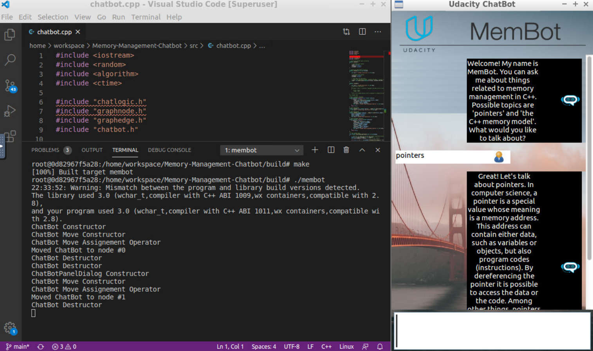
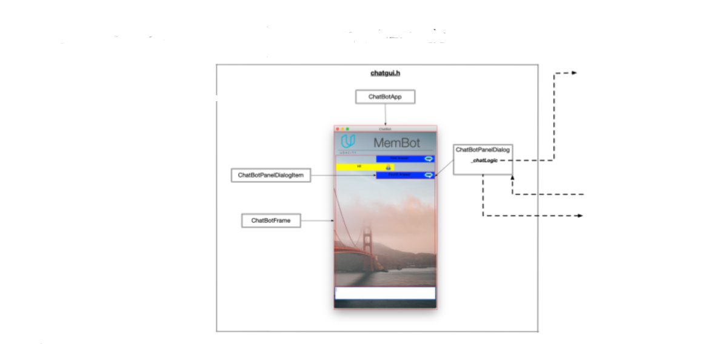
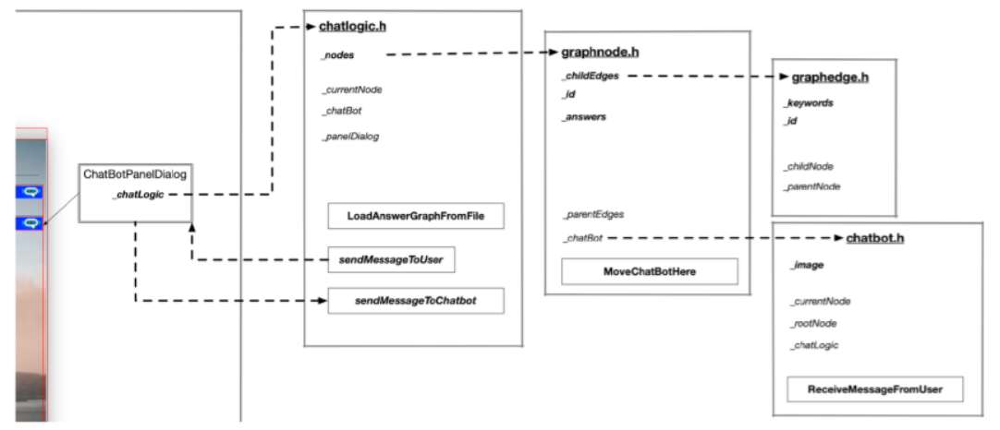

# Memory-Management-Chatbot
This is my solution for the 3rd project in the [Udacity C++ Nanodegree Program](https://www.udacity.com/course/c-plus-plus-nanodegree--nd213). The goal of this project is to optimize a chatbot-application with respect to memory management on the heap.

## Summary
The ChatBot code creates a dialogue where users can ask questions about some aspects of memory management in C++. After the knowledge base of the chatbot has been loaded from a text file, a knowledge graph representation is created in computer memory, where chatbot answers represent the graph nodes and user queries represent the graph edges. After a user query has been sent to the chatbot, the Levenshtein distance is used to identify the most probable answer.

## Dependencies
This section lists all dependencies that the application needs to be build and run.
* cmake >= 3.11
  * All OSes: [click here for installation instructions](https://cmake.org/install/)
* make >= 4.1 (Linux, Mac), 3.81 (Windows)
  * Linux: make is installed by default on most Linux distros
  * Mac: [install Xcode command line tools to get make](https://developer.apple.com/xcode/features/)
  * Windows: [Click here for installation instructions](http://gnuwin32.sourceforge.net/packages/make.htm)
* gcc/g++ >= 5.4
  * Linux: gcc / g++ is installed by default on most Linux distros
  * Mac: same deal as make - [install Xcode command line tools](https://developer.apple.com/xcode/features/)
  * Windows: recommend using [MinGW](http://www.mingw.org/)
* wxWidgets >= 3.0
  * Linux: `sudo apt-get install libwxgtk3.0-gtk3-dev libwxgtk3.0-gtk3-0v5`. If you are facing unmet dependency issues, refer to the [official page](https://wiki.codelite.org/pmwiki.php/Main/WxWidgets30Binaries#toc2) for installing the unmet dependencies.
  * Mac: There is a [homebrew installation available](https://formulae.brew.sh/formula/wxmac).
  * Installation instructions can be found [here](https://wiki.wxwidgets.org/Install). Some version numbers may need to be changed in instructions to install v3.0 or greater.

## Instructions to Build & Run
This section explains how to build & run the application.
1. Clone this repo.
2. Make a build directory in the top level directory: `mkdir build && cd build`
3. Compile: `cmake .. && make`
4. Run it: `./membot`.
A successful deployment on an Ubuntu-Linux System looks like displayed in the figure above.

## Architecture of the Application & Optimizations made to the Original Source Code
The original cource code of the application can be found [here](https://github.com/udacity/CppND-Memory-Management-Chatbot). Several optimizations have been made to the source code including management of classes on the heap with smart pointers. The architecture of the source code is described in the class diagrams below.
Diagram one...

Diagram two describes how...are related

